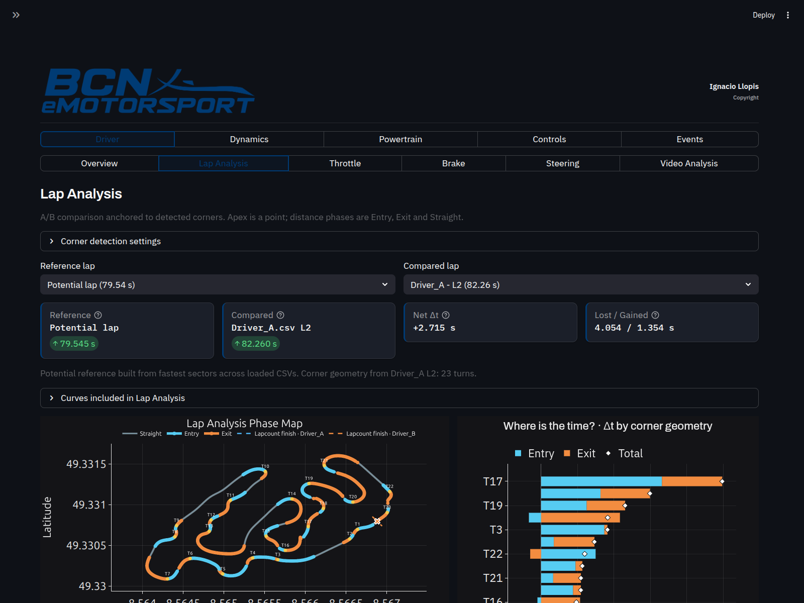
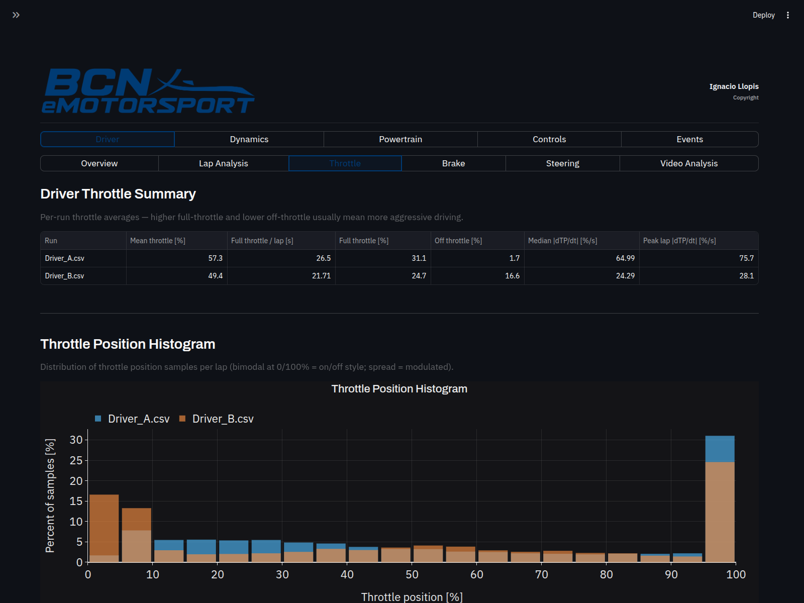
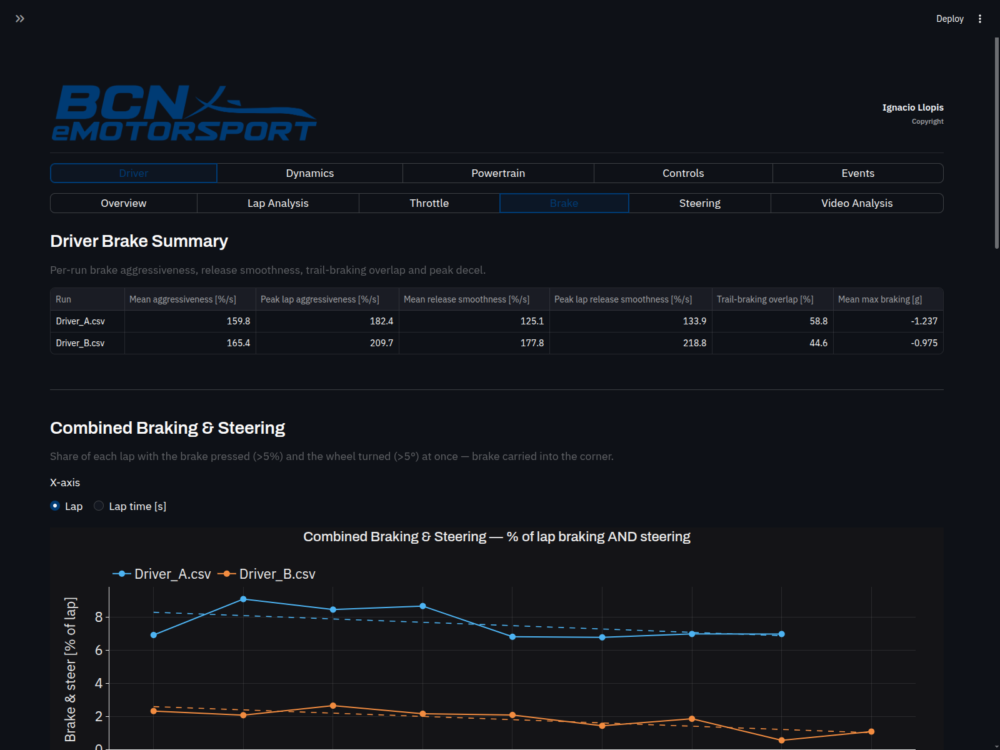
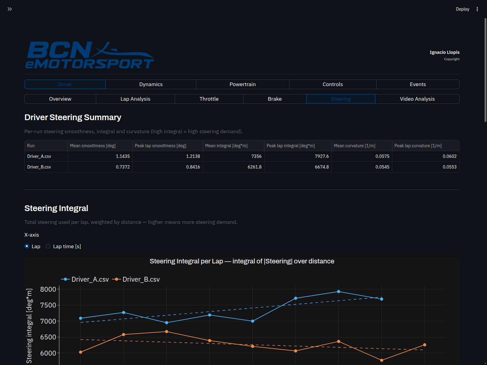
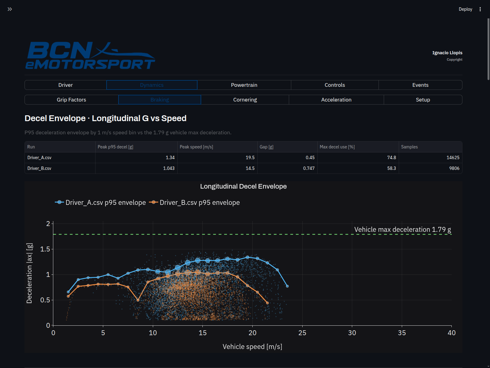
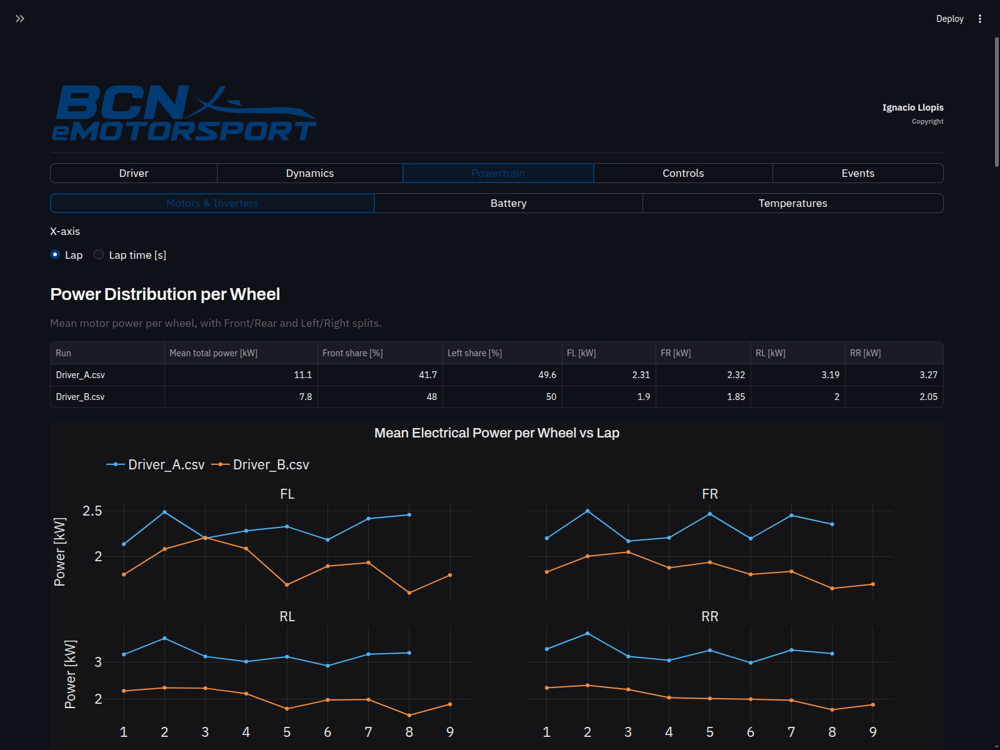
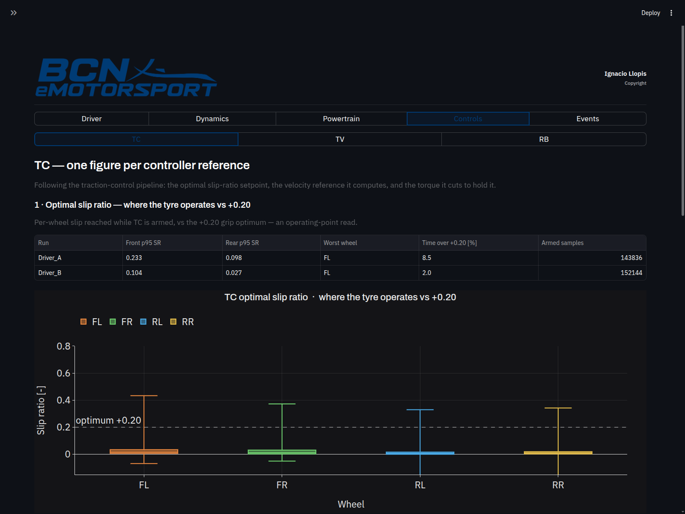
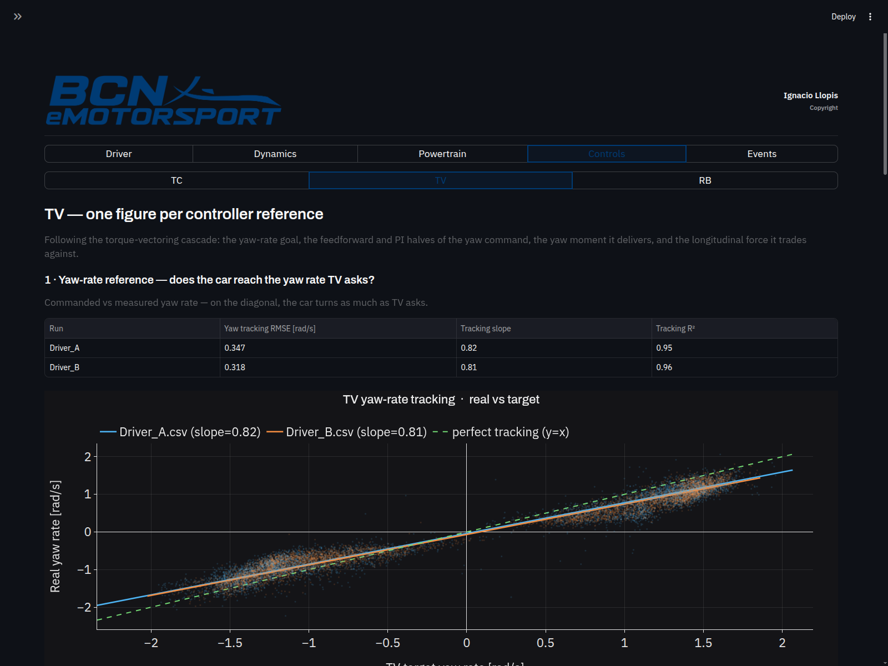
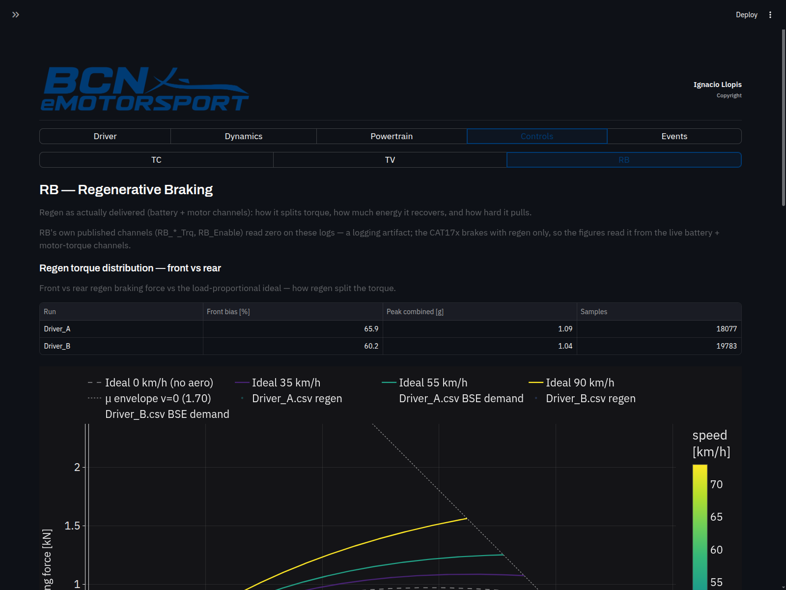

# CAT17x Telemetry Dashboard

> Interactive race-engineering dashboard for a 4WD electric Formula Student car.
> Turns 100 Hz on-car telemetry into actionable insights.
> Control-system tuning and setup work.

Built with **Streamlit · Plotly · Polars · NumPy**.



---

## What it does

Drop one or more telemetry CSVs (100 Hz) into `data/`, pick the laps you want,
and the dashboard turns ~250 raw channels into the answers a race engineer
actually asks after a run:

- **Where is my driver losing time, corner by corner?**
- **Is the active control suite (TC / TV / RB / PC) doing its job — or fighting the driver?**
- **How is the powertrain holding up — energy, thermal, power-cap headroom?**
- **How does driver A compare to driver B on the same track, lap by lap?**

Every chart is fully interactive (zoom, hover, lap-selector, A/B compare),
every module supports multi-run overlay, and the GPS map doubles as a
selection tool to define track sections on the fly.

The dashboard is organised into five top-level sections — **Driver**,
**Dynamics**, **Powertrain**, **Controls** and **Events** — plus a dedicated
**Events** mode for acceleration and skidpad runs.

---

## Highlights

### Driver — Overview, Lap Analysis, Throttle / Brake / Steering, Video
A full driver workspace:

- **Overview** — per-lap table (lap time + speeds), fastest-lap speed maps,
  pace, lap & sector times and the interactive circuit map.
- **Lap Analysis** — corner-anchored lap comparison: detects corners from GPS
  curvature, snaps each lap to the same geometry and answers **"where is the
  time?"** broken down by Entry / Apex / Exit / Straight, with a GPS time-gain
  map, a per-corner Δt heatmap, a GG diagram and synchronised channel plots.
- **Throttle / Brake / Steering** — per-driver KPI tables plus distributions,
  per-lap evolution and per-corner breakdowns. Built for direct A/B coaching:
  Driver A vs Driver B at FSG below.
- **Video Analysis** — sync on-board video against the telemetry timeline.


| Throttle | Brake | Steering |
|---|---|---|
|  |  |  |

### Vehicle dynamics
Split into **Braking**, **Cornering**, **Acceleration**, **Setup** and
**Grip Factors**:

- **Braking** — longitudinal-decel envelope, brake blending (hydraulic vs
  pedal), ideal front/rear brake distribution, per-axle utilisation
  (|Fx| / μ·Fz), braking slip and wheel-locking time.
- **Cornering** — lateral grip envelope, per-axle lateral utilisation,
  understeer/oversteer balance by corner phase, understeer angle and the
  steering-vs-lateral-g US/OS curve.
- **Acceleration** — traction envelope, slip curve, per-axle traction
  utilisation and drive distribution vs load transfer.
- **Setup** — static-mass / Fz reference, roll split (LLTD, roll gradient vs
  theory), pitch gradient and per-phase damper velocity histograms.
- **Grip Factors** — grip overview, evolution and time-at-the-limit.



### Powertrain
Per-wheel power split (4 motors), inverter load (overload & i²t), torque
fidelity, torque–speed operating map, net energy per lap, battery SoC /
voltage sag / weakest cell under load, HV delivery efficiency, thermal soak
and a dedicated **PC — 80 kW battery power-cap** check.



### Vehicle control systems
Dedicated tabs for each active control loop, each laid out as **one figure per
controller reference** — following the signal pipeline the controller actually
runs.

#### Traction Control (TC)
Walks the TC pipeline: the optimal slip-ratio setpoint, the velocity reference
it computes, and the torque it cuts to hold it.



#### Torque Vectoring (TV)
Walks the TV cascade: the yaw-rate goal, the feedforward and PI halves of the
yaw command, the yaw moment (Mz) it delivers and the longitudinal force (Fx)
it trades against.



#### Regenerative Braking (RB)
Slip-ratio tracking around the −0.20 braking target, front/rear regen torque
distribution and the capture ratio (energy recovered ÷ braking energy).



### Events — Acceleration & Skidpad
Dedicated summaries for the FS dynamic events: the 75 m acceleration run and
the skidpad, each with its own KPI block and per-run plots.

---

## The car — CAT17x

4WD electric Formula Student prototype, one motor per wheel:

| System | Acronym | Setpoint |
|---|---|---|
| Torque Vectoring | TV | yaw-rate model tracking |
| Traction Control | TC | slip ratio **+0.20** |
| Regenerative Braking | RB | slip ratio **−0.20** |
| Power Control | PC | battery cap **80 kW** |

---

## Tech stack

- **Streamlit** — UI shell, multi-CSV state, lap selectors
- **Polars** — 100 Hz channel processing (lazy + columnar, ~10× faster than pandas on this workload)
- **Plotly** — every chart, dark theme, fully interactive
- **NumPy / SciPy** — corner detection, curvature, signal smoothing
- **Custom GPS track-map component** (TypeScript / Streamlit Components)
  for interactive section drawing and click-to-include/exclude corners

CSV format: **100 Hz**, `TimeStamp` in seconds, ~250 channels covering IMU,
GPS, motors (×4), inverters, battery, brake pressures, steering and the
controller internals (TV / TC / RB / PC).

---

## Run it locally

```bash
pip install -r requirements.txt
streamlit run src/dashboard.py
```

Drop telemetry CSVs in `data/`. Any number of runs can be compared
side-by-side from the sidebar.

---

## Screenshots

All screenshots in [`screenshots/`](screenshots/) are generated
from real telemetry: two FSG laps from Driver A and Driver B compared
on the same circuit.

---

## License & copyright

**Copyright © 2026 Ignacio Llopis. All Rights Reserved.**

This repository is published for portfolio and evaluation purposes only.
Commercial use, redistribution and derivative works require **written
permission** from the author. See [LICENSE](LICENSE) for full terms.

For licensing or collaboration enquiries: **ignalloba@gmail.com**
