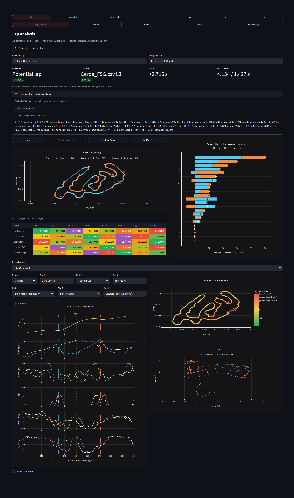
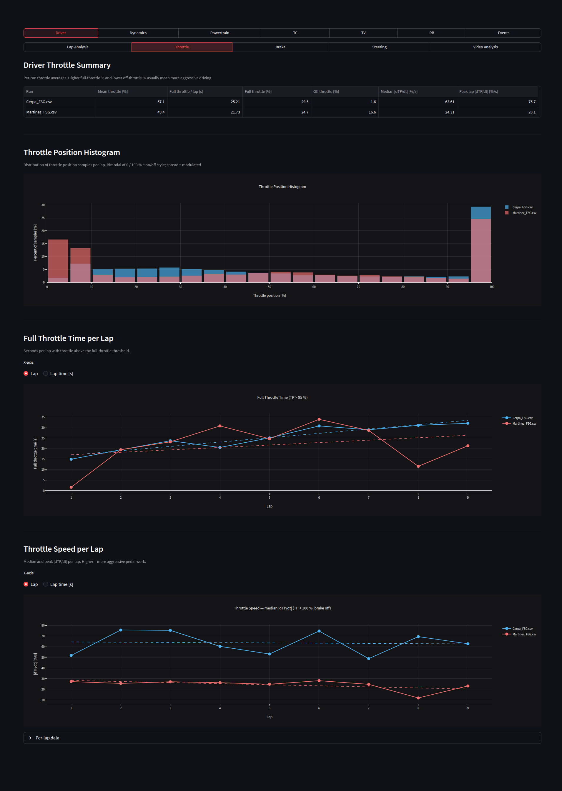
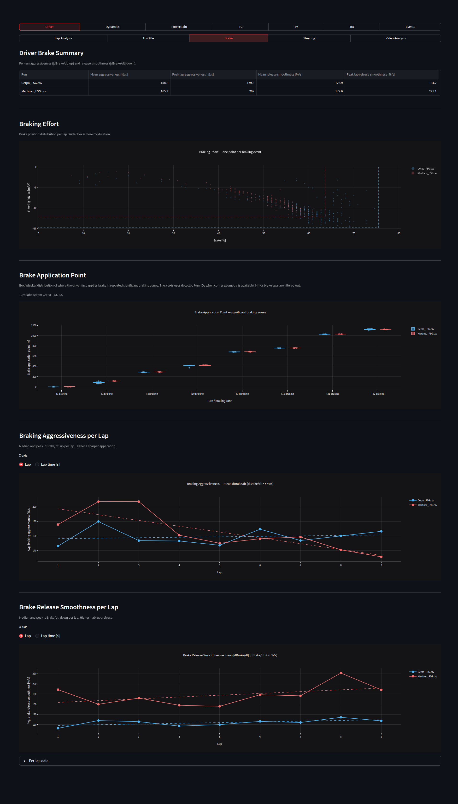
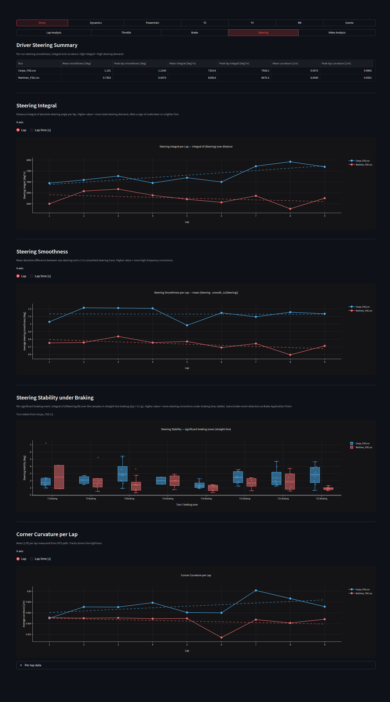
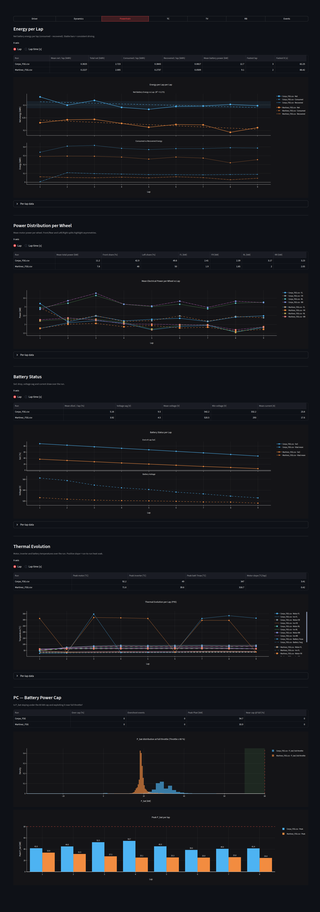
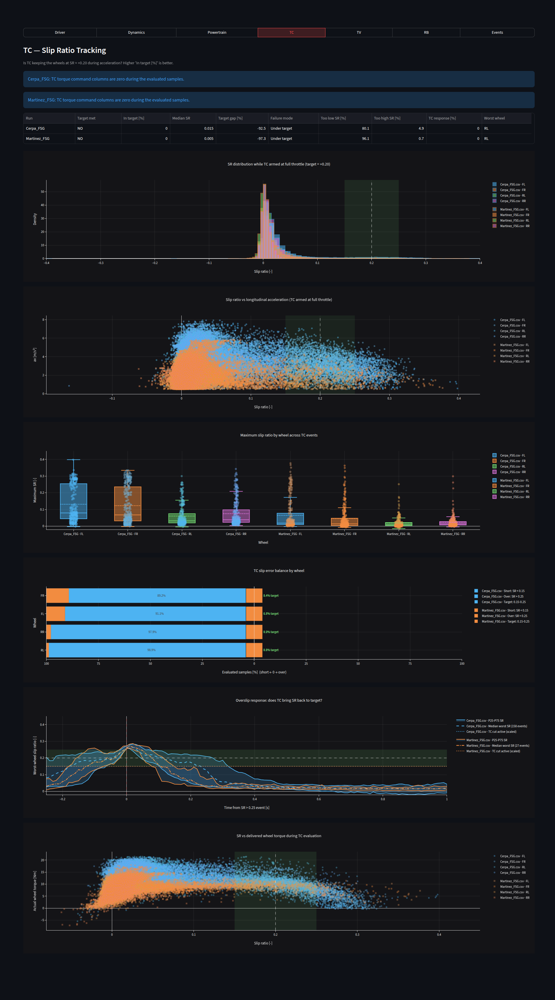
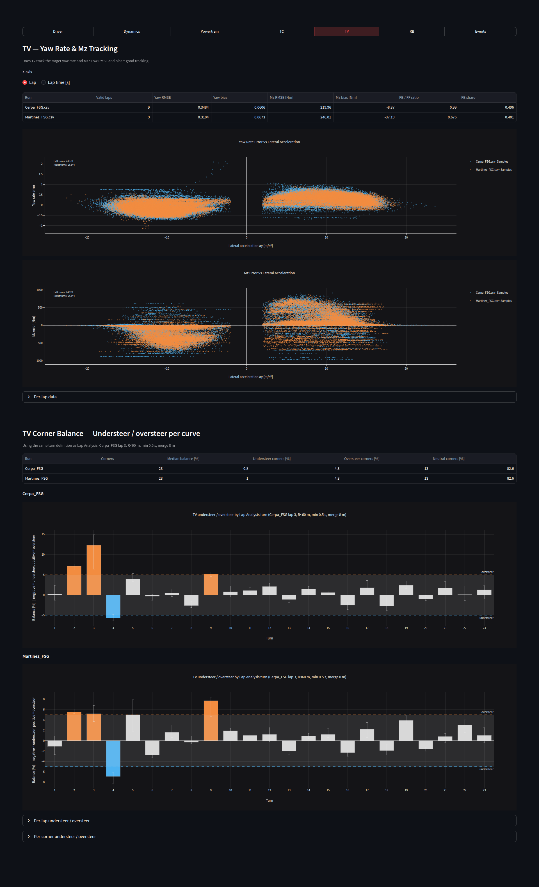
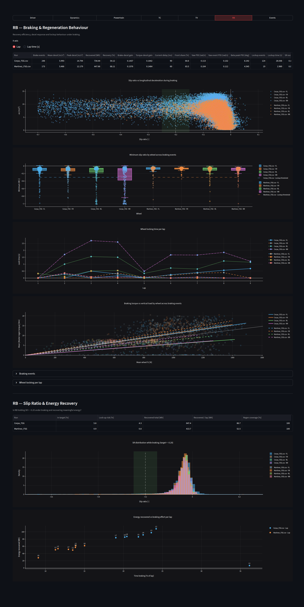

# CAT17x Telemetry Dashboard

> Interactive race-engineering dashboard for a 4WD electric Formula Student car.
> Turns 100 Hz on-car telemetry into actionable insights.
> Control-system tuning and setup work.

Built with **Streamlit · Plotly · Polars · NumPy**.



---

## What it does

Drop one or more telemetry CSVs (100 Hz) into `data/`, pick the laps you want,
and the dashboard turns ~250 raw channels into the answers a race engineer
actually asks after a run:

- **Where is my driver losing time, corner by corner?**
- **Is the active control suite (TC / TV / RB / PC) doing its job — or fighting the driver?**
- **How is the powertrain holding up — energy, thermal, power-cap headroom?**
- **How does driver A compare to driver B on the same track, lap by lap?**

Every chart is fully interactive (zoom, hover, lap-selector, A/B compare),
every module supports multi-run overlay, and the GPS map doubles as a
selection tool to define track sections on the fly.

---

## Highlights

### Corner-anchored lap comparison
Detects corners from GPS curvature, snaps each lap to the same geometry
and answers **"where is the time?"** broken down by Entry / Apex / Exit /
Straight. Includes a GPS time-gain map, a per-corner Δt heatmap, GG diagram
and synchronised channel plots.


### Driver performance — Throttle / Brake / Steering
Per-driver KPI tables plus distributions, per-lap evolution and per-corner
breakdowns. Built for direct A/B coaching: Cerpa vs Martinez at FSG below.

| Throttle | Brake | Steering |
|---|---|---|
|  |  |  |

### Vehicle dynamics
Longitudinal-decel envelope, ideal-braking curve vs measured regen,
braking-stability (steering vs yaw-rate) and lap-by-lap stability metrics.


### Powertrain
Net energy per lap, per-wheel power split (4 motors), battery SoC / voltage
sag / current draw, thermal soak and a dedicated **PC — 80 kW battery
power-cap** check.



### Vehicle control systems
Dedicated tabs for each active control loop on the car.

#### Traction Control (TC)
Slip-ratio tracking around the +0.20 acceleration target — histograms,
per-corner box plots, time-in-band bars and throttle-response curves.



#### Torque Vectoring (TV)
Yaw-rate and Yz tracking + per-curve understeer/oversteer balance —
catches the corners where TV is helping vs hurting.



#### Regenerative Braking (RB)
Slip-ratio tracking around the −0.20 braking target, throttle-vs-regen
behaviour, per-corner box plots and energy recovered per lap.



---

## The car — CAT17x

4WD electric Formula Student prototype, one motor per wheel:

| System | Acronym | Setpoint |
|---|---|---|
| Torque Vectoring | TV | yaw-rate model tracking |
| Traction Control | TC | slip ratio **+0.20** |
| Regenerative Braking | RB | slip ratio **−0.20** |
| Power Control | PC | battery cap **80 kW** |

---

## Tech stack

- **Streamlit** — UI shell, multi-CSV state, lap selectors
- **Polars** — 100 Hz channel processing (lazy + columnar, ~10× faster than pandas on this workload)
- **Plotly** — every chart, dark theme, fully interactive
- **NumPy / SciPy** — corner detection, curvature, signal smoothing
- **Custom GPS track-map component** (TypeScript / Streamlit Components)
  for interactive section drawing and click-to-include/exclude corners

CSV format: **100 Hz**, `TimeStamp` in seconds, ~250 channels covering IMU,
GPS, motors (×4), inverters, battery, brake pressures, steering and the
controller internals (TV / TC / RB / PC).

---

## Run it locally

```bash
pip install -r requirements.txt
streamlit run src/dashboard.py
```

Drop telemetry CSVs in `data/`. Any number of runs can be compared
side-by-side from the sidebar.

---

## Screenshots

All screenshots in [`docs/screenshots/`](docs/screenshots/) are generated
from real telemetry: two FSG laps from drivers Cerpa and Martinez compared
on the same circuit.

---

## License & copyright

**Copyright © 2026 Ignacio Llopis. All Rights Reserved.**

This repository is published for portfolio and evaluation purposes only.
Commercial use, redistribution and derivative works require **written
permission** from the author. See [LICENSE](LICENSE) for full terms.

For licensing or collaboration enquiries: **ignalloba@gmail.com**
